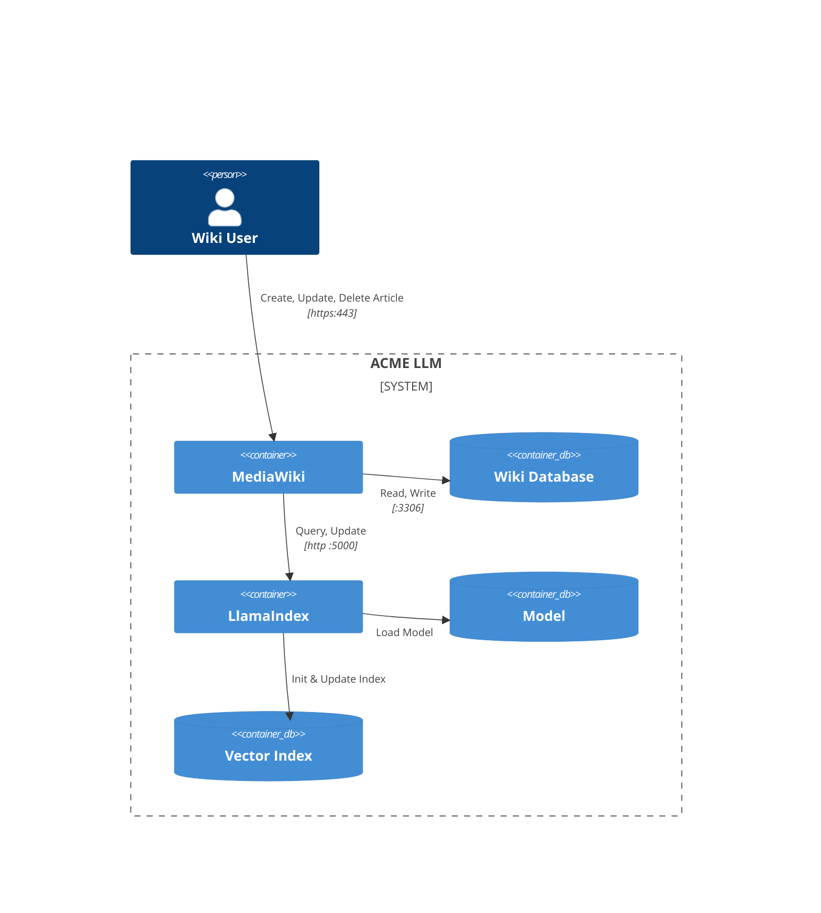
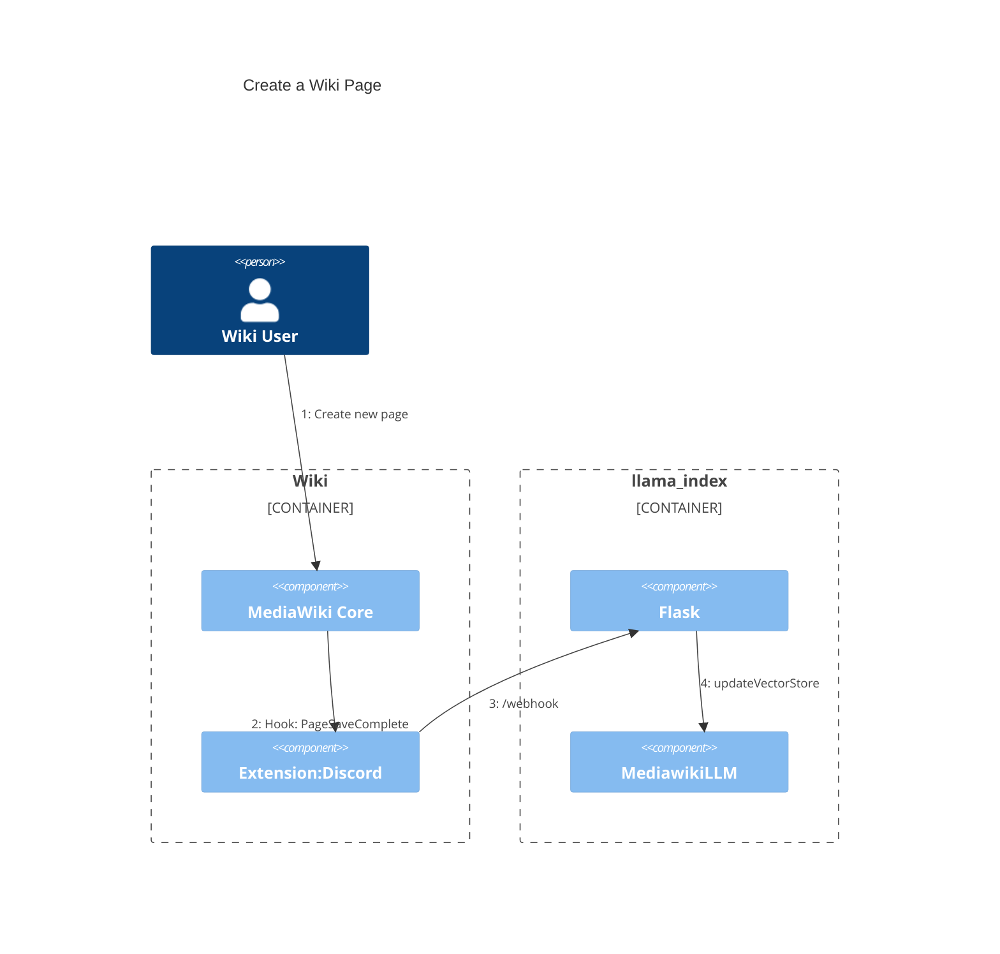

# Architecture
## Container Diagram

### MediaWiki
MediaWiki is an open-source wiki engine designed for collaborative content creation and management. It utilizes a robust API (Application Programming Interface) that allows developers to programmatically access, retrieve, and manipulate data within the MediaWiki system, facilitating seamless integration with external applications and services.

### LlamaIndex
LlamaIndex allows you to connect to data sources and add your data to the data that LLMs already have. This is often referred to as Retrieval-Augmented Generation (RAG). RAG allows you to use LLMs to query, transform and generate new insights from your data.

In the context of RAG, the retrieval component retrieves relevant information from a knowledge base based on the original prompt. The retrieved information is then incorporated into the prompt before generating a final response. This modification allows the model to leverage external knowledge to enhance the quality, relevance, and contextuality of the generated content. The combination of retrieval and generation mechanisms in RAG enables a more nuanced and informed response compared to traditional generative models.

## Vector Index
In terms of LlamaIndex, a Vector Index is a data structure that is made up of document objects to enable querying by an LLM.

## Phase 1: Create the Vector Index
In the likely event that the wiki already has content, the vector index must be initialised with this content.

## Phase 2: Keep the Vector Index up-to-date

### Bootstrap

The bootstrap of the application is represented by the following steps:

1. initialise the LLM
    This creates the Service_Context and spawns the LLM.

2. load the input data using the reader
    => This part is done by reader/MediawikiPagesReader.py. 
    It does the following 
        1. iterates all namespaces 
        2. calls the MW API "AllPages" with the given namespace (with pagination), saves all URLs
        3. iterates all given URLs and saves their HTML as text. 
    Result: A key(URL) => value(HTML as text) list to use with Llama_Index.
    The process is not multithreaded yet.

3. Create VectorStoreIndex from documents
    This part creates a VectorStoreIndex from the input collected in step 2.

4. create query engine
    this part creates the final queryable object from the previously created index.

5. Query running 
